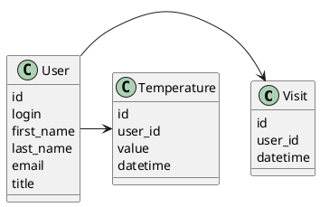

# Компонентная архитектура
<!-- Состав и взаимосвязи компонентов системы между собой и внешними системами с указанием протоколов, ключевые технологии, используемые для реализации компонентов.
Диаграмма контейнеров C4 и текстовое описание. 
-->
## Компонентная диаграмма

```plantuml
@startuml
!include https://raw.githubusercontent.com/plantuml-stdlib/C4-PlantUML/master/C4_Container.puml

AddElementTag("microService", $shape=EightSidedShape(), $bgColor="CornflowerBlue", $fontColor="white", $legendText="microservice")
AddElementTag("storage", $shape=RoundedBoxShape(), $bgColor="lightSkyBlue", $fontColor="white")

Person(admin, "Администратор")
Person(user, "Пользователь")

System_Ext(web_site, "Web-сайт для работы с умным домом", "Web-интерфейс")

System_Boundary(conference_site, "Web-сайт для работы с умным домом") {
   'Container(web_site, "Клиентский веб-сайт", ")
   Container(client_service, "Сервис авторизации", "C++", "Сервис управления пользователями", $tags = "microService")    
   Container(visit_service, "Сервис визитов", "C++", "Сервис мониторинга входов и выходов", $tags = "microService") 
   Container(temp_service, "Сервис температуры", "C++", "Сервис мониторинга и анализа температуры", $tags = "microService")   
   ContainerDb(db, "База данных", "MySQL", "Хранение данных о темпиратуре  и посещениях", $tags = "storage")
   
}


Rel(user, web_site, "Получение информации: о входах/выходах в дом, о текущем значении температуры дома и истории изменяя температуры")
Rel(admin, web_site, "Регистрация/поиск/удаление пользователей.")

Rel(web_site, client_service, "Работа с пользователями", "localhost/person")
Rel(client_service, db, "INSERT/SELECT/UPDATE", "SQL")

Rel(web_site, visit_service, "Работа с визитами", "localhost/visit")
Rel(visit_service, db, "INSERT/SELECT/UPDATE", "SQL")

Rel(web_site, temp_service, "Работа с темпиратурой", "localhost/temp")
Rel(temp_service, db, "INSERT/SELECT/UPDATE", "SQL")

@enduml
```
## Список компонентов  

### Сервис авторизации
**API**:
-	Создание нового пользователя +
      - входные параметры: login, пароль, имя, фамилия, email, обращение (г-н/г-жа)
      - выходные параметры: отсутствуют
-	Поиск пользователя по логину +
     - входные параметры:  login
     - выходные параметры: имя, фамилия, email, обращение (г-н/г-жа)
-	Поиск пользователя по маске имени и фамилии +
     - входные параметры: маска фамилии, маска имени
     - выходные параметры: login, имя, фамилия, email, обращение (г-н/г-жа)

### Сервис визитов
**API**:
- Фиксация визита +
  - Входные параметры: ID пользователя, время визита
  - Выходыне параметры: идентификатор визита
- Получение списка всех визитов +
  - Входные параметры: отсутствуют
  - Выходные параметры: время визита, данные пользователя

### Сервис темпирауры
**API**:
- Измерение текущего состояния темпиратуры
  - Входные параметры: данные с датчика темпиратуры, время измерения, id пользователя
  - Выходные параметры: идентификатор измерения
- Получение данных о температуре
  - Входные параметры: интересующий диапазон даты и времени
  - Выходные параметры: массив с измерениями темпиратуры

### Модель данных
